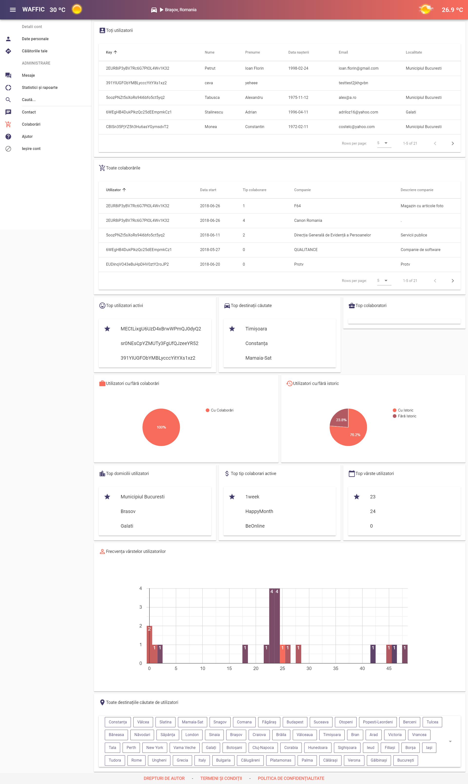
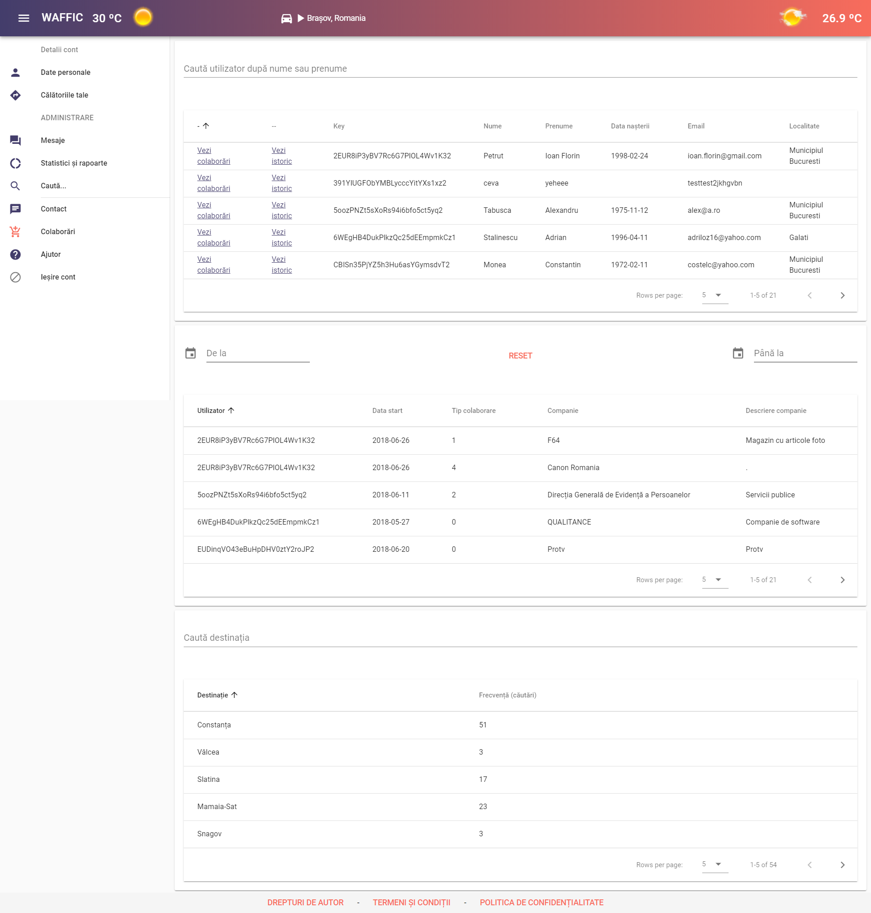

# Waffic

Integrated application for tracking weather and traffic conditions, using AccuWeather, Google Maps and Google Charts APIs.

## Development

The application is also live [HERE](https://universityraking.web.app/). 
This project was created using [Vue.js CLI](https://vuejs.org/) version 2.5.2. 
For database used to store the data is [Firebase Realtime Database](https://firebase.google.com/docs/database). 
 
To run the project on your machine use `npm run dev` for a dev server. Navigate to `http://localhost:8081/`. The app will automatically reload if you change any of the source files.

## Screenshots
* General access
    * Homepage 
    
    * Signup 
    
    * Collaborations 
    
    * Contact 
    
    * Tutorial 
    
* Users with general account access
    * User details 
    
    * Travel history 
    
    * Map 
    
* Administrators access
    * Menu  
    
    * Messages  
    
    * Statistics  
    
    * Database search  
    

* Database  
